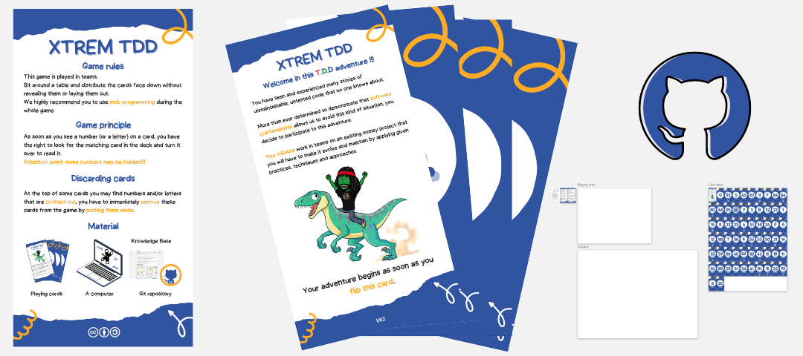

# Xtrem TDD escape game
This game is played in teams. 
Sit around a table and distribute the cards face down without revealing them or laying them out.
We highly recommend you to use `mob programming` during the whole game.

## Principle
As soon as you see a number (or a letter) on a card, you have the right to look for the matching card in the deck and turn it over to read it.

> Attention point: some numbers may be hidden!!!!

## Discarding cards
At the top of some cards you may find numbers and/or letters that are `crossed out`, you have to immediately `remove` these cards from the game by putting them `aside`.

## Material
- Playing cards, you have several options here:
  - [Print the cards](files/xtrem-tdd-printable-cards.pdf) (`Tarot` cards: 60mm x 113mm)
  - [Use the miro board](files/xtrem-tdd-miro-board.rtb) and follow the instructions
- A computer
- Access to internet

## Start the game

## Solution
A facilitator guide is available [here](files/xtrem-tdd-cards-solution.pdf)

## Print the game
We have printed our card game through [Print Europe](https://printeurope.fr/jeux-de-cartes-personnalises_en.html).

We highly recommend their professionalism and quality 👌

Created by [Guillaume Faas](https://www.linkedin.com/in/guillaumefaas/) and [Yoan Thirion](https://www.linkedin.com/in/yoanthirion/)
